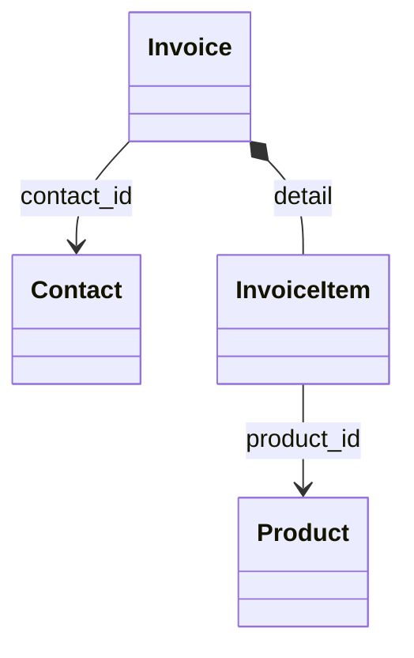
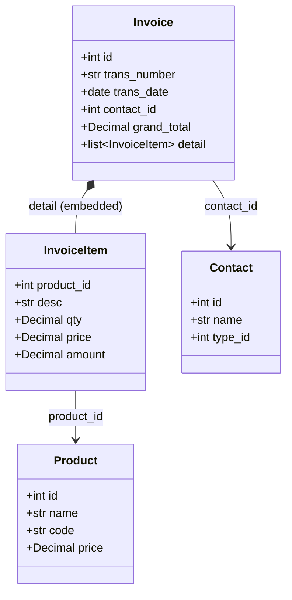

# Phase 2: Documentation Layer - Research

**Researched:** 2026-01-22
**Domain:** MkDocs Documentation Generation, llms.txt AI Discovery, Mermaid ERD Diagrams
**Confidence:** HIGH

## Summary

This research investigates the technical domain for generating comprehensive, AI-readable API documentation from the Phase 1 entity registry. The primary deliverables are: (1) API endpoint catalog mapping tools to operations, (2) entity relationship documentation with Mermaid diagrams, (3) MkDocs site with Material theme, and (4) llms.txt file for AI tool discovery.

The recommended approach uses **MkDocs with Material theme** as the documentation framework, **pydantic-2-mermaid** for generating Mermaid class diagrams from entity models, and a **structured llms.txt** following the llmstxt.org specification. The existing Phase 1 entity registry (`src/entities/`) provides the foundation for auto-generating schema documentation, while the 7 tool modules (`src/tools/*.py`) containing 20 MCP tools define the API surface to document.

**Primary recommendation:** Use MkDocs Material with mkdocstrings for API documentation, generate Mermaid ERDs from Pydantic models via pydantic-2-mermaid, organize docs by business domain (Sales, Purchases, Inventory, Finance), and create llms.txt with tool-discovery-optimized content grouped by entity.

## Standard Stack

The established libraries/tools for this domain:

### Core
| Library | Version | Purpose | Why Standard |
|---------|---------|---------|--------------|
| mkdocs | 1.6+ | Static site generator | Foundation for Material theme, mature ecosystem |
| mkdocs-material | 9.7+ | Modern documentation theme | Feature-rich, search, dark mode, code annotations |
| mkdocstrings[python] | 0.27+ | Auto-generate API docs from docstrings | Pydantic support, Material theme integration |
| pydantic-2-mermaid | 0.8+ | Generate Mermaid class diagrams from Pydantic v2 | Direct Mermaid output, no Graphviz dependency |

### Supporting
| Library | Version | Purpose | When to Use |
|---------|---------|---------|-------------|
| mkdocs-mermaid2-plugin | 1.0+ | Render Mermaid in MkDocs (alternative) | If Material native mermaid insufficient |
| mkdocs-gen-files | 0.5+ | Generate virtual files at build time | For auto-generating API reference pages |
| mkdocs-literate-nav | 0.6+ | Specify navigation in Markdown | For dynamic navigation based on generated content |
| erdantic | 1.2+ | Graphviz-based ERD diagrams | For full ERD PNG/SVG output (erdantic already in requirements.txt) |

### Alternatives Considered
| Instead of | Could Use | Tradeoff |
|------------|-----------|----------|
| MkDocs Material | Sphinx | MkDocs simpler for Markdown-first docs; Sphinx more powerful but complex |
| pydantic-2-mermaid | erdantic only | erdantic produces Graphviz format, not Mermaid; need both for dual visualization |
| mkdocstrings | Manual markdown | Auto-generation reduces maintenance; manual allows more control |
| Native Material mermaid | mermaid2-plugin | Native is recommended, works with instant loading; plugin has minify conflicts |

**Installation:**
```bash
pip install mkdocs-material "mkdocstrings[python]" pydantic-2-mermaid mkdocs-gen-files mkdocs-literate-nav
```

Note: `erdantic` already in requirements.txt for Graphviz ERD output.

## Architecture Patterns

### Recommended Project Structure
```
docs/
├── index.md                 # Landing page with project overview
├── getting-started.md       # Quick start for AI agents
├── entities/                # Entity documentation
│   ├── index.md             # Entity overview + ERD diagram
│   ├── contact.md           # Contact entity (includes embedded types)
│   ├── product.md           # Product entity + Warehouse embedded type
│   ├── invoice.md           # Invoice entity + InvoiceItem embedded type
│   ├── order.md             # Order entity + OrderItem embedded type
│   ├── delivery.md          # Delivery entity + DeliveryItem embedded type
│   └── account.md           # Account entity
├── tools/                   # MCP Tool documentation
│   ├── index.md             # Tool catalog + endpoint mapping
│   ├── sales/               # Sales domain tools
│   │   ├── invoices.md      # invoice_list_sales, invoice_get_detail, etc.
│   │   └── orders.md        # order_list_sales, order_get_detail
│   ├── purchases/           # Purchase domain tools
│   │   ├── invoices.md      # invoice_list_purchase
│   │   └── orders.md        # order_list_purchase
│   ├── inventory/           # Inventory domain tools
│   │   ├── products.md      # product_list, product_get_detail, etc.
│   │   └── deliveries.md    # delivery_list, delivery_get_detail, etc.
│   ├── finance/             # Finance domain tools
│   │   └── reports.md       # financial_* tools
│   ├── crm/                 # CRM domain tools
│   │   └── contacts.md      # contact_list, contact_get_detail, etc.
│   └── system/              # System tools
│       └── utilities.md     # utility_* tools
├── api-reference/           # Auto-generated from mkdocstrings
│   └── ...                  # Generated per-module documentation
├── javascripts/             # Custom JS if needed
│   └── mermaid.mjs          # Mermaid customization (optional)
├── stylesheets/             # Custom CSS if needed
│   └── extra.css            # Theme overrides (optional)
└── erd.png                  # Full ERD from erdantic (Graphviz)
mkdocs.yml                   # MkDocs configuration
llms.txt                     # AI tool discovery file
```

### Pattern 1: Hybrid Template + Auto-generated Content
**What:** Markdown templates with placeholder sections that get populated from entity schemas and tool definitions at build time.
**When to use:** For entity and tool documentation pages - combines human-authored context with machine-generated accuracy.
**Example:**
```markdown
# Invoice Entity

> Sales or Purchase invoice representing a transaction.

## Overview
[Human-authored business context about invoices in Kledo]

## Schema
<!-- AUTO-GENERATED: Invoice schema from Pydantic model -->
::: src.entities.models.invoice.Invoice
    options:
      show_root_heading: true
      members_order: source

## Relationships


## Related Tools
- [`invoice_list_sales`](../tools/sales/invoices.md#invoice_list_sales) - List sales invoices
- [`invoice_get_detail`](../tools/sales/invoices.md#invoice_get_detail) - Get invoice details
```

### Pattern 2: MkDocs Material Configuration
**What:** Comprehensive mkdocs.yml configuration enabling all required features.
**When to use:** Project setup and configuration.
**Example:**
```yaml
# Source: https://squidfunk.github.io/mkdocs-material/getting-started/
site_name: Kledo MCP Server
site_url: https://example.github.io/kledo-api-mcp
site_description: MCP Server for Kledo API - AI-readable documentation

theme:
  name: material
  features:
    - navigation.tabs
    - navigation.sections
    - navigation.expand
    - navigation.top
    - search.suggest
    - search.highlight
    - content.code.copy
    - content.code.annotate
  palette:
    - scheme: default
      primary: indigo
      accent: indigo
      toggle:
        icon: material/brightness-7
        name: Switch to dark mode
    - scheme: slate
      primary: indigo
      accent: indigo
      toggle:
        icon: material/brightness-4
        name: Switch to light mode

markdown_extensions:
  - pymdownx.superfences:
      custom_fences:
        - name: mermaid
          class: mermaid
          format: !!python/name:pymdownx.superfences.fence_code_format
  - pymdownx.highlight:
      anchor_linenums: true
  - pymdownx.tabbed:
      alternate_style: true
  - admonition
  - pymdownx.details
  - attr_list
  - md_in_html
  - toc:
      permalink: true

plugins:
  - search
  - mkdocstrings:
      handlers:
        python:
          options:
            docstring_style: google
            show_source: false
            show_root_heading: true
            members_order: source

nav:
  - Home: index.md
  - Getting Started: getting-started.md
  - Entities:
    - Overview: entities/index.md
    - Contact: entities/contact.md
    - Product: entities/product.md
    - Invoice: entities/invoice.md
    - Order: entities/order.md
    - Delivery: entities/delivery.md
    - Account: entities/account.md
  - Tools:
    - Catalog: tools/index.md
    - Sales:
      - Invoices: tools/sales/invoices.md
      - Orders: tools/sales/orders.md
    - Purchases:
      - Invoices: tools/purchases/invoices.md
      - Orders: tools/purchases/orders.md
    - Inventory:
      - Products: tools/inventory/products.md
      - Deliveries: tools/inventory/deliveries.md
    - Finance:
      - Reports: tools/finance/reports.md
    - CRM:
      - Contacts: tools/crm/contacts.md
    - System:
      - Utilities: tools/system/utilities.md
```

### Pattern 3: llms.txt for Tool Discovery
**What:** Structured Markdown file following llmstxt.org spec for AI agent tool discovery.
**When to use:** Enable AI agents to discover and select the right tool for a task.
**Example:**
```markdown
# Kledo MCP Server

> MCP Server connecting AI agents to Kledo accounting software. Provides read-only access to invoices, contacts, products, orders, deliveries, and financial reports.

This server exposes 20 tools organized by business domain. Use this file to find the right tool for querying Kledo business data.

## Invoice Tools

Tools for sales and purchase invoice operations.

- [invoice_list_sales](https://docs.example.com/tools/sales/invoices#invoice_list_sales): List sales invoices. Use for: "show me invoices", "customer billing", "unpaid invoices". Parameters: search, contact_id, status_id, date_from, date_to, per_page.
- [invoice_get_detail](https://docs.example.com/tools/sales/invoices#invoice_get_detail): Get invoice details with line items. Use for: "invoice details", "show invoice INV-001". Required: invoice_id.
- [invoice_get_totals](https://docs.example.com/tools/sales/invoices#invoice_get_totals): Get invoice summary totals. Use for: "total outstanding", "overdue amount". Parameters: date_from, date_to.
- [invoice_list_purchase](https://docs.example.com/tools/purchases/invoices#invoice_list_purchase): List purchase invoices (vendor bills). Use for: "bills from vendors", "purchase invoices". Parameters: search, contact_id, status_id, date_from, date_to.

## Contact Tools

Tools for customer and vendor CRM operations.

- [contact_list](https://docs.example.com/tools/crm/contacts#contact_list): List customers and vendors. Use for: "show customers", "find vendor", "contact list". Parameters: search, type_id (1=Customer, 2=Vendor, 3=Both).
- [contact_get_detail](https://docs.example.com/tools/crm/contacts#contact_get_detail): Get contact details. Use for: "customer info", "vendor details". Required: contact_id.
- [contact_get_transactions](https://docs.example.com/tools/crm/contacts#contact_get_transactions): Get contact transaction history. Use for: "customer purchases", "transaction history". Required: contact_id.

## Product Tools

Tools for product catalog and inventory.

- [product_list](https://docs.example.com/tools/inventory/products#product_list): List products with prices. Use for: "product catalog", "show inventory". Parameters: search, include_inventory, per_page.
- [product_get_detail](https://docs.example.com/tools/inventory/products#product_get_detail): Get product details. Use for: "product info", "check stock". Required: product_id.
- [product_search_by_sku](https://docs.example.com/tools/inventory/products#product_search_by_sku): Find product by SKU. Use for: "lookup SKU", "product by code". Required: sku.

## Order Tools

Tools for sales and purchase orders.

- [order_list_sales](https://docs.example.com/tools/sales/orders#order_list_sales): List sales orders. Use for: "pending orders", "customer orders". Parameters: search, contact_id, status_id, date_from, date_to.
- [order_get_detail](https://docs.example.com/tools/sales/orders#order_get_detail): Get order details. Use for: "order info", "order items". Required: order_id.
- [order_list_purchase](https://docs.example.com/tools/purchases/orders#order_list_purchase): List purchase orders. Use for: "POs", "orders to vendors". Parameters: search, contact_id, date_from, date_to.

## Delivery Tools

Tools for shipment tracking.

- [delivery_list](https://docs.example.com/tools/inventory/deliveries#delivery_list): List deliveries. Use for: "shipments", "delivery status". Parameters: search, date_from, date_to, status_id.
- [delivery_get_detail](https://docs.example.com/tools/inventory/deliveries#delivery_get_detail): Get delivery details. Use for: "tracking info", "shipment details". Required: delivery_id.
- [delivery_get_pending](https://docs.example.com/tools/inventory/deliveries#delivery_get_pending): Get pending deliveries. Use for: "unshipped orders", "pending shipments".

## Financial Tools

Tools for financial reports.

- [financial_activity_team_report](https://docs.example.com/tools/finance/reports#financial_activity_team_report): Team activity report. Use for: "what did team do", "activity log". Parameters: date_from, date_to.
- [financial_sales_summary](https://docs.example.com/tools/finance/reports#financial_sales_summary): Sales by customer. Use for: "top customers", "sales report". Parameters: date_from, date_to, contact_id.
- [financial_purchase_summary](https://docs.example.com/tools/finance/reports#financial_purchase_summary): Purchases by vendor. Use for: "vendor spending", "purchase report". Parameters: date_from, date_to, contact_id.
- [financial_bank_balances](https://docs.example.com/tools/finance/reports#financial_bank_balances): Bank account balances. Use for: "cash on hand", "bank balances".

## System Tools

- [utility_clear_cache](https://docs.example.com/tools/system/utilities#utility_clear_cache): Clear cached data.
- [utility_get_cache_stats](https://docs.example.com/tools/system/utilities#utility_get_cache_stats): Cache performance metrics.
- [utility_test_connection](https://docs.example.com/tools/system/utilities#utility_test_connection): Test API connection.

## Optional

- [Full Documentation](https://docs.example.com/): Complete MkDocs site with entity schemas, ERD diagrams, and API reference
- [Entity Registry](https://docs.example.com/entities/): Pydantic model schemas and relationships
```

### Pattern 4: Mermaid ERD from Pydantic Models
**What:** Generate Mermaid class diagrams directly from Pydantic model definitions.
**When to use:** Creating embedded diagrams for entity relationship visualization.
**Example:**
```python
# Source: https://github.com/EricWebsmith/pydantic-2-mermaid
from pydantic_mermaid import MermaidGenerator
import src.entities.models as models

# Generate diagram
generator = MermaidGenerator(models)
chart = generator.generate_chart()

# Write to file for embedding in docs
with open("docs/entities/erd.mmd", "w") as f:
    f.write(chart)

# Or generate simplified diagram manually for focused views:
INVOICE_DIAGRAM = """

"""
```

### Pattern 5: GitHub Actions Deployment
**What:** CI/CD workflow for automated documentation deployment to GitHub Pages.
**When to use:** Enable automatic documentation updates on push.
**Example:**
```yaml
# .github/workflows/docs.yml
# Source: https://squidfunk.github.io/mkdocs-material/publishing-your-site/
name: Deploy Documentation

on:
  push:
    branches:
      - main
    paths:
      - 'docs/**'
      - 'mkdocs.yml'
      - 'src/entities/**'
      - 'src/tools/**'

permissions:
  contents: write

jobs:
  deploy:
    runs-on: ubuntu-latest
    steps:
      - uses: actions/checkout@v4

      - name: Configure Git Credentials
        run: |
          git config user.name github-actions[bot]
          git config user.email github-actions[bot]@users.noreply.github.com

      - uses: actions/setup-python@v5
        with:
          python-version: 3.x

      - name: Cache dependencies
        uses: actions/cache@v4
        with:
          key: mkdocs-material-${{ hashFiles('requirements*.txt') }}
          path: ~/.cache
          restore-keys: |
            mkdocs-material-

      - name: Install dependencies
        run: pip install mkdocs-material "mkdocstrings[python]" pydantic-2-mermaid

      - name: Deploy to GitHub Pages
        run: mkdocs gh-deploy --force
```

### Anti-Patterns to Avoid
- **Manually maintaining tool lists:** Use reflection/introspection to extract tool metadata from `get_tools()` functions
- **Separate diagrams per entity:** Use one comprehensive ERD with Mermaid, plus focused views embedded in entity pages
- **Duplicating content between docs and llms.txt:** llms.txt is for discovery, docs for detail - different purposes
- **Over-customizing Material theme:** Stick to configuration, avoid custom CSS unless necessary
- **Using mermaid2-plugin with Material:** Native Material mermaid support is recommended and better integrated

## Don't Hand-Roll

Problems that look simple but have existing solutions:

| Problem | Don't Build | Use Instead | Why |
|---------|-------------|-------------|-----|
| Schema documentation | Custom markdown generators | mkdocstrings | Handles edge cases, stays in sync with code |
| ERD diagrams | Custom Graphviz DOT templates | pydantic-2-mermaid + erdantic | Automatic model introspection, relationship detection |
| Documentation site | Custom static site generator | MkDocs Material | Search, navigation, theming, responsive design |
| Dark mode | Custom CSS | Material theme palette | Automatic, consistent, includes diagram adaptation |
| API reference | Manual documentation | mkdocstrings autodoc | Always accurate, reduces maintenance burden |
| Tool inventory | Manual list maintenance | Introspect `get_tools()` functions | Single source of truth in code |

**Key insight:** The Phase 1 entity registry provides machine-readable schemas via Pydantic's `model_json_schema()`. Documentation generation should leverage this rather than duplicating definitions.

## Common Pitfalls

### Pitfall 1: Mermaid Plugin Conflicts
**What goes wrong:** Using mkdocs-mermaid2-plugin with mkdocs-minify-plugin or instant loading causes rendering failures.
**Why it happens:** Plugin execution order and JavaScript loading conflicts.
**How to avoid:** Use Material's native Mermaid support (pymdownx.superfences custom_fences) instead of mermaid2-plugin.
**Warning signs:** Diagrams not rendering, JavaScript errors in console, blank diagram blocks.

### Pitfall 2: mkdocstrings Import Errors
**What goes wrong:** mkdocstrings fails to import modules for documentation generation.
**Why it happens:** Module dependencies or incorrect Python path configuration.
**How to avoid:** Ensure `src/` is in Python path during build. Add `PYTHONPATH=.` to build command or configure in mkdocs.yml.
**Warning signs:** "ModuleNotFoundError" during `mkdocs build`, missing API documentation sections.

### Pitfall 3: llms.txt Too Verbose or Too Terse
**What goes wrong:** AI agents either miss important tool information or get overwhelmed with detail.
**Why it happens:** Unclear balance between discovery hints and full documentation.
**How to avoid:** Follow the pattern: tool name, one-line description, "Use for:" with natural language queries, key parameters. Link to full docs for details.
**Warning signs:** AI agents selecting wrong tools, asking for clarification on tool purpose.

### Pitfall 4: Stale Documentation
**What goes wrong:** Documentation doesn't reflect current code state after tool or entity changes.
**Why it happens:** Manual documentation updates lag behind code changes.
**How to avoid:** Use mkdocstrings for API docs, auto-generate tool catalogs from code introspection, include docs in CI pipeline.
**Warning signs:** Tool descriptions in docs don't match actual behavior, missing new tools.

### Pitfall 5: Broken Cross-References
**What goes wrong:** Links between entity pages and tool pages break or become inconsistent.
**Why it happens:** Renaming pages, changing navigation structure without updating links.
**How to avoid:** Use relative links consistently, validate with `mkdocs build --strict`, consider mkdocs-redirects for moved pages.
**Warning signs:** 404 errors in documentation, "page not found" during local preview.

### Pitfall 6: Embedded Types Lost in Navigation
**What goes wrong:** Users can't find documentation for InvoiceItem, OrderItem, etc.
**Why it happens:** Embedded types don't have their own pages, only exist within parent entity pages.
**How to avoid:** Per CONTEXT.md decision, keep embedded types on parent pages but with clear section headers and anchor links. Add search keywords.
**Warning signs:** Users asking "where is InvoiceItem documented?"

## Code Examples

Verified patterns from official sources:

### Generate Mermaid from Pydantic Models
```python
# Source: https://github.com/EricWebsmith/pydantic-2-mermaid
from pydantic_mermaid import MermaidGenerator
from pathlib import Path

# Import entity models module
import src.entities.models as models

def generate_mermaid_erd(output_path: Path) -> str:
    """Generate Mermaid class diagram from all entity models."""
    generator = MermaidGenerator(models)
    chart = generator.generate_chart()

    output_path.write_text(chart, encoding="utf-8")
    return chart

# Usage
mermaid_chart = generate_mermaid_erd(Path("docs/entities/erd.mmd"))
```

### Extract Tool Catalog from Code
```python
# Tool introspection for documentation generation
from typing import Any
from pathlib import Path
import importlib

TOOL_MODULES = [
    "src.tools.invoices",
    "src.tools.contacts",
    "src.tools.products",
    "src.tools.orders",
    "src.tools.deliveries",
    "src.tools.financial",
    "src.tools.utilities",
]

def extract_tool_catalog() -> list[dict[str, Any]]:
    """Extract tool definitions from all tool modules."""
    tools = []

    for module_path in TOOL_MODULES:
        module = importlib.import_module(module_path)
        module_tools = module.get_tools()

        for tool in module_tools:
            tools.append({
                "name": tool.name,
                "description": tool.description,
                "module": module_path.split(".")[-1],
                "parameters": tool.inputSchema.get("properties", {}),
                "required": tool.inputSchema.get("required", []),
            })

    return tools

# Result: 20 tools with full metadata
```

### MkDocs Configuration for Mermaid
```yaml
# Source: https://squidfunk.github.io/mkdocs-material/reference/diagrams/
markdown_extensions:
  - pymdownx.superfences:
      custom_fences:
        - name: mermaid
          class: mermaid
          format: !!python/name:pymdownx.superfences.fence_code_format
```

### mkdocstrings Python Module Reference
```markdown
# Source: https://mkdocstrings.github.io/
# In docs/api-reference/entities.md

# Entity Models

::: src.entities.models
    options:
      show_root_heading: true
      show_source: false
      members_order: source
      docstring_style: google
```

### llms.txt File List Section
```markdown
# Source: https://llmstxt.org/
## Invoice Tools

- [invoice_list_sales](https://example.com/tools#invoice_list_sales): List sales invoices with filtering. Use for: "show invoices", "unpaid bills", "customer invoices"
- [invoice_get_detail](https://example.com/tools#invoice_get_detail): Get invoice details with line items. Use for: "invoice info", "show invoice #123"
```

## State of the Art

| Old Approach | Current Approach | When Changed | Impact |
|--------------|------------------|--------------|--------|
| Sphinx for Python docs | MkDocs Material | ~2020 | Simpler Markdown-first workflow, modern UI |
| Custom ERD scripts | pydantic-2-mermaid | 2025 | Native Pydantic v2 to Mermaid support |
| robots.txt for AI | llms.txt | Jan 2026 | Dedicated AI discovery standard (v1.0.0) |
| mermaid2-plugin | Material native mermaid | MkDocs Material 9.x | Better integration, no plugin conflicts |
| Manual API docs | mkdocstrings | ~2021 | Auto-sync with code, less maintenance |

**Deprecated/outdated:**
- `mkdocs-mermaid2-plugin` for Material theme: Native support preferred, plugin has minify conflicts
- Sphinx autodoc for new projects: mkdocstrings with MkDocs is simpler for Markdown-first projects
- Manual llms.txt without structure: v1.0.0 spec (Jan 2026) establishes canonical format

## Open Questions

Things that couldn't be fully resolved:

1. **pydantic-2-mermaid output customization**
   - What we know: Generates class diagrams automatically
   - What's unclear: Level of control over diagram appearance (colors, grouping)
   - Recommendation: Test default output, supplement with hand-crafted Mermaid for focused views

2. **llms.txt optimal verbosity**
   - What we know: CONTEXT.md specifies "detailed verbosity" with examples
   - What's unclear: Exact balance for effective AI tool selection
   - Recommendation: Include "Use for:" hints with natural language variations, iterate based on agent testing

3. **mkdocstrings Pydantic model rendering**
   - What we know: mkdocstrings has Python handler with Pydantic support
   - What's unclear: How well it renders `json_schema_extra` relationship metadata
   - Recommendation: Test with existing entity models, may need custom templates

4. **Dual ERD visualization (Mermaid + erdantic)**
   - What we know: CONTEXT.md requires Mermaid for simple views, erdantic for full ERD
   - What's unclear: Whether both are needed or Mermaid sufficient
   - Recommendation: Generate both - Mermaid embedded in docs, erdantic PNG for full overview

## Sources

### Primary (HIGH confidence)
- [Material for MkDocs Installation](https://squidfunk.github.io/mkdocs-material/getting-started/) - Setup, configuration, plugins
- [Material for MkDocs Diagrams](https://squidfunk.github.io/mkdocs-material/reference/diagrams/) - Native Mermaid configuration
- [Material for MkDocs Publishing](https://squidfunk.github.io/mkdocs-material/publishing-your-site/) - GitHub Pages deployment workflow
- [llmstxt.org Specification](https://llmstxt.org/) - llms.txt format specification v1.0.0
- [mkdocstrings Documentation](https://mkdocstrings.github.io/) - Auto-documentation from Python code
- [pydantic-2-mermaid GitHub](https://github.com/EricWebsmith/pydantic-2-mermaid) - Pydantic v2 to Mermaid conversion

### Secondary (MEDIUM confidence)
- [mkdocs-literate-nav](https://github.com/oprypin/mkdocs-literate-nav) - Dynamic navigation from Markdown
- [mkdocs-gen-files](https://oprypin.github.io/mkdocs-gen-files/) - Virtual file generation at build time
- [erdantic Documentation](https://erdantic.drivendata.org/stable/) - Graphviz ERD from Pydantic models

### Tertiary (LOW confidence)
- General WebSearch patterns for documentation organization by business domain
- Community discussions on llms.txt adoption (standard is new as of Jan 2026)

## Metadata

**Confidence breakdown:**
- Standard stack: HIGH - All libraries well-documented, Material theme is mature
- Architecture: HIGH - Patterns verified with official documentation
- Pitfalls: MEDIUM - Some based on community experience, mermaid conflicts verified
- llms.txt format: MEDIUM - Specification is new (v1.0.0 Jan 2026), limited production examples

**Research date:** 2026-01-22
**Valid until:** 2026-03-22 (60 days - stable domain, MkDocs Material mature)

---

*Phase: 02-documentation-layer*
*Research completed: 2026-01-22*
