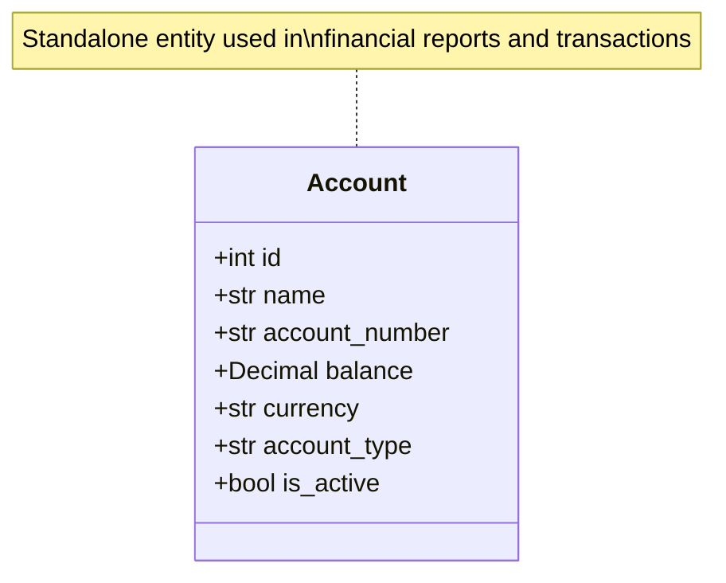

# Account

Bank or cash account in the Kledo financial system.

Accounts represent financial accounts used to track money - bank accounts, cash on hand, credit cards, etc. They are used in financial reports and transactions.

## Relationships



## Fields

| Field | Type | Description |
|-------|------|-------------|
| `id` | int | Unique identifier (from BaseEntity) |
| `name` | str | Account name (e.g., 'BCA Checking') |
| `account_number` | str (optional) | Bank account number |
| `balance` | Decimal | Current balance |
| `currency` | str | Currency code (ISO 4217), default: IDR |
| `account_type` | str (optional) | Account type (e.g., 'bank', 'cash', 'credit_card') |
| `is_active` | bool | Whether account is active |

## Account Types

| account_type | Description |
|--------------|-------------|
| `bank` | Bank checking/savings account |
| `cash` | Physical cash on hand |
| `credit_card` | Credit card account |

## Related Tools

- `financial_bank_balances` - Get all bank account balances

## Example

```json
{
  "id": 101,
  "name": "BCA Checking - Operations",
  "account_number": "1234567890",
  "balance": "50000000.00",
  "currency": "IDR",
  "account_type": "bank",
  "is_active": true
}
```
