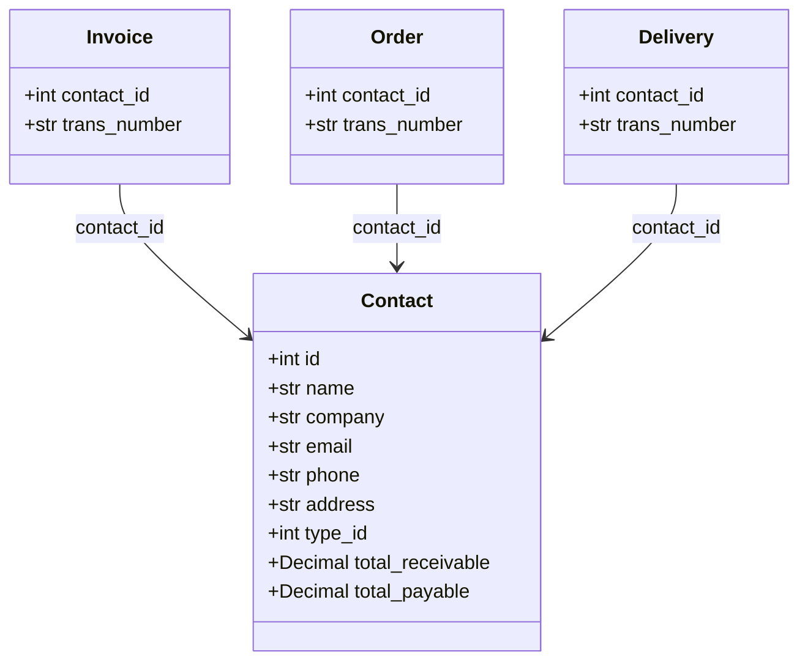

# Contact

Customer or Vendor contact in the Kledo system.

Contacts represent the parties you do business with - customers who buy from you (receivables) and vendors you buy from (payables). A contact can be both a customer and vendor.

## Relationships



## Fields

| Field | Type | Description |
|-------|------|-------------|
| `id` | int | Unique identifier (from BaseEntity) |
| `name` | str | Contact's full name |
| `company` | str (optional) | Company/organization name |
| `email` | str (optional) | Email address |
| `phone` | str (optional) | Phone number |
| `address` | str (optional) | Physical address |
| `type_id` | int | Contact type: 1=Customer, 2=Vendor, 3=Both |
| `type_name` | str (optional) | Denormalized type name |
| `total_receivable` | Decimal | Amount owed by this contact |
| `total_payable` | Decimal | Amount owed to this contact |

## Contact Types

| type_id | Name | Description |
|---------|------|-------------|
| 1 | Customer | Buys from you, creates receivables |
| 2 | Vendor | You buy from them, creates payables |
| 3 | Both | Acts as both customer and vendor |

## Related Tools

- `contact_list` - List customers and vendors with filtering
- `contact_get_detail` - Get contact details by ID
- `contact_get_transactions` - Get transaction history for a contact

## Example

```json
{
  "id": 1234,
  "name": "PT Maju Bersama",
  "company": "PT Maju Bersama",
  "email": "info@majubersama.co.id",
  "phone": "+62-21-555-1234",
  "address": "Jl. Sudirman No. 123, Jakarta",
  "type_id": 1,
  "type_name": "Customer",
  "total_receivable": "15000000.00",
  "total_payable": "0.00"
}
```
