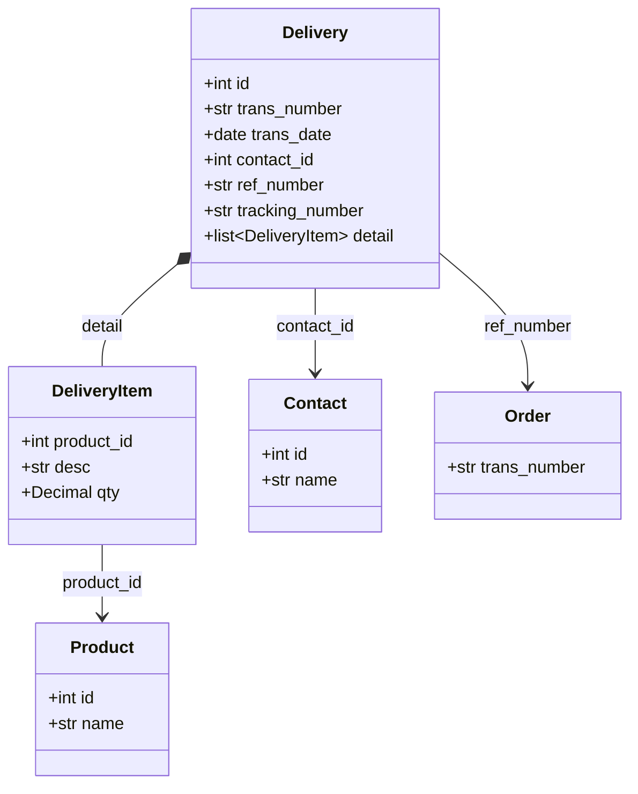

# Delivery

Shipment/delivery record tracking the physical movement of goods.

Deliveries document when products are shipped to customers or received from vendors. They link to orders and track shipping details like carrier and tracking number.

## Relationships



## Fields

| Field | Type | Description |
|-------|------|-------------|
| `id` | int | Unique identifier (from BaseEntity) |
| `trans_number` | str | Delivery number (e.g., DEL-2026-0001) |
| `trans_date` | date | Delivery date |
| `contact_id` | int (optional) | Customer receiving delivery |
| `contact_name` | str (optional) | Denormalized contact name |
| `status_id` | int | Delivery status ID |
| `status_name` | str (optional) | Denormalized status name |
| `shipping_company_name` | str (optional) | Carrier/shipping company |
| `tracking_number` | str (optional) | Shipment tracking number |
| `shipping_address` | str (optional) | Destination address |
| `ref_number` | str (optional) | Reference to source order |
| `detail` | list[DeliveryItem] | Items being delivered |
| `memo` | str (optional) | Delivery notes |

## Embedded Type: DeliveryItem

Item being delivered. Embedded within Delivery.

| Field | Type | Description |
|-------|------|-------------|
| `product_id` | int (optional) | Product reference |
| `desc` | str | Item description |
| `qty` | Decimal | Quantity being delivered |

## Related Tools

- `delivery_list` - List deliveries with filtering
- `delivery_get_detail` - Get delivery details
- `delivery_get_pending` - Get pending (unshipped) deliveries

## Example

```json
{
  "id": 7890,
  "trans_number": "DEL-2026-0023",
  "trans_date": "2026-01-18",
  "contact_id": 1234,
  "contact_name": "PT Maju Bersama",
  "status_id": 2,
  "status_name": "Shipped",
  "shipping_company_name": "JNE Express",
  "tracking_number": "JNE1234567890",
  "shipping_address": "Jl. Sudirman No. 123, Jakarta",
  "ref_number": "SO-2026-0015",
  "detail": [
    {
      "product_id": 5678,
      "desc": "Widget Pro X100",
      "qty": "3.00"
    }
  ],
  "memo": "Handle with care"
}
```
