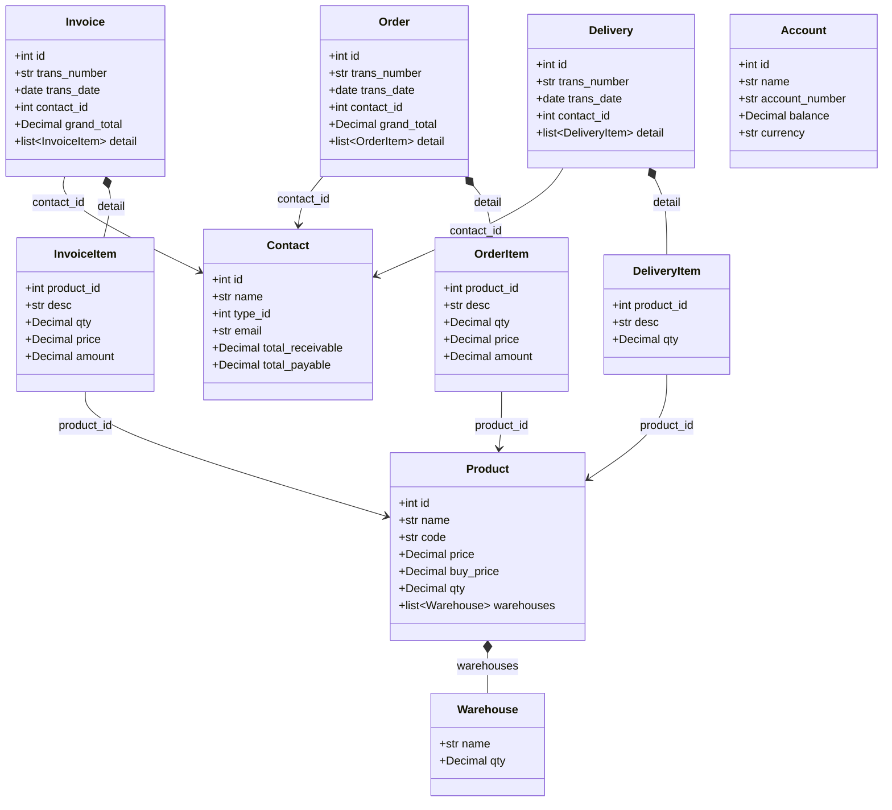

# Entity Registry

The Kledo MCP Server uses a typed entity registry built on Pydantic models. This provides:

- **Type safety** - All data validated against defined schemas
- **JSON Schema generation** - Automatic schema export for tool definitions
- **Relationship metadata** - Entity relationships documented via `json_schema_extra`

## Entity Overview

| Entity | Description | Key Relationships |
|--------|-------------|-------------------|
| [Contact](contact.md) | Customers and vendors | Referenced by Invoice, Order, Delivery |
| [Product](product.md) | Product catalog items | Contains Warehouse (stock), referenced by line items |
| [Invoice](invoice.md) | Sales/purchase invoices | References Contact, contains InvoiceItem |
| [Order](order.md) | Sales/purchase orders | References Contact, contains OrderItem |
| [Delivery](delivery.md) | Shipment records | References Contact, contains DeliveryItem |
| [Account](account.md) | Bank/cash accounts | Used in financial reports |

## Entity Relationship Diagram



## Embedded Types

Some entities contain embedded types (nested models) rather than foreign key references:

| Parent | Embedded Type | Description |
|--------|---------------|-------------|
| Invoice | InvoiceItem | Line items within an invoice |
| Order | OrderItem | Line items within an order |
| Delivery | DeliveryItem | Items being delivered |
| Product | Warehouse | Stock quantity by warehouse location |

These embedded types are documented on their parent entity pages.

## Entity Registry API

Access entities programmatically via the loader module:

```python
from src.entities.loader import (
    get_entity_class,
    get_all_entities,
    get_entity_schema,
    ENTITY_REGISTRY,
    EMBEDDED_TYPES,
)

# Get entity class by name (case-insensitive)
Invoice = get_entity_class("invoice")

# Get JSON schema for an entity
schema = get_entity_schema("contact")

# List all registered entities
for name, cls in ENTITY_REGISTRY.items():
    print(f"{name}: {cls.__doc__}")
```
