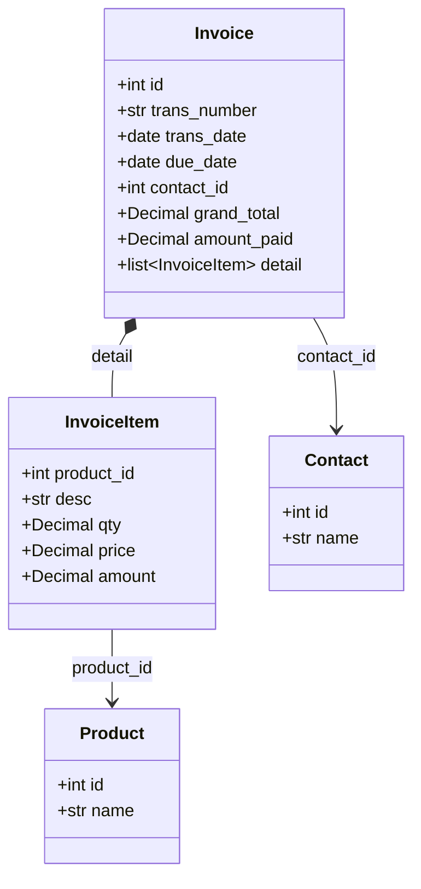

# Invoice

Sales or Purchase invoice representing a financial transaction.

Invoices record the sale of goods/services to customers (sales invoice) or purchases from vendors (purchase invoice). Each invoice contains line items detailing the products/services transacted.

## Relationships



## Fields

| Field | Type | Description |
|-------|------|-------------|
| `id` | int | Unique identifier (from BaseEntity) |
| `trans_number` | str | Invoice number (e.g., INV-2026-0001) |
| `trans_date` | date | Invoice date |
| `due_date` | date (optional) | Payment due date |
| `contact_id` | int | Customer/vendor reference |
| `contact_name` | str (optional) | Denormalized contact name |
| `status_id` | int | Invoice status ID |
| `status_name` | str (optional) | Denormalized status name |
| `subtotal` | Decimal | Sum of line items before tax |
| `tax_amount` | Decimal | Total tax amount |
| `grand_total` | Decimal | Total including tax |
| `amount_paid` | Decimal | Amount already paid |
| `detail` | list[InvoiceItem] | Invoice line items |
| `memo` | str (optional) | Internal notes |

## Embedded Type: InvoiceItem

Line item within an invoice. Embedded within Invoice.

| Field | Type | Description |
|-------|------|-------------|
| `product_id` | int (optional) | Product reference |
| `desc` | str | Item description |
| `qty` | Decimal | Quantity |
| `price` | Decimal | Unit price |
| `amount` | Decimal | Line total (qty * price) |

## Related Tools

- `invoice_list_sales` - List sales invoices with filtering
- `invoice_list_purchase` - List purchase invoices (vendor bills)
- `invoice_get_detail` - Get invoice details with line items
- `invoice_get_totals` - Get invoice summary totals

## Example

```json
{
  "id": 9012,
  "trans_number": "INV-2026-0042",
  "trans_date": "2026-01-15",
  "due_date": "2026-02-14",
  "contact_id": 1234,
  "contact_name": "PT Maju Bersama",
  "status_id": 2,
  "status_name": "Sent",
  "subtotal": "500000.00",
  "tax_amount": "55000.00",
  "grand_total": "555000.00",
  "amount_paid": "0.00",
  "detail": [
    {
      "product_id": 5678,
      "desc": "Widget Pro X100",
      "qty": "2.00",
      "price": "250000.00",
      "amount": "500000.00"
    }
  ],
  "memo": "Urgent order"
}
```
