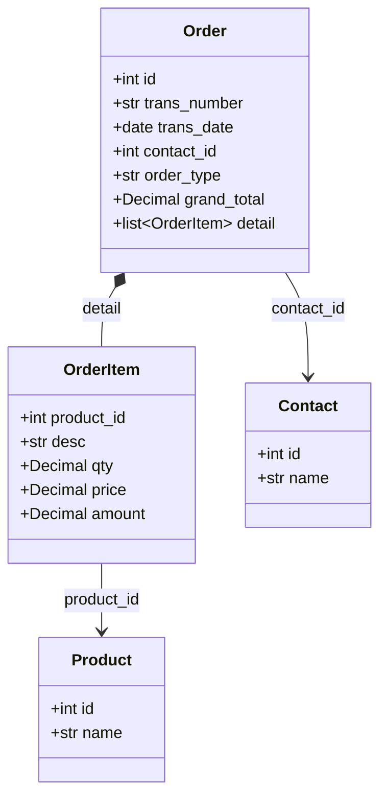

# Order

Sales or Purchase order representing a business commitment.

Orders capture the intent to sell to a customer (sales order) or purchase from a vendor (purchase order). Orders typically precede invoices and deliveries.

## Relationships



## Fields

| Field | Type | Description |
|-------|------|-------------|
| `id` | int | Unique identifier (from BaseEntity) |
| `trans_number` | str | Order number (e.g., SO-2026-0001) |
| `trans_date` | date | Order date |
| `contact_id` | int | Customer (sales) or Vendor (purchase) reference |
| `contact_name` | str (optional) | Denormalized contact name |
| `status_id` | int | Order status ID |
| `status_name` | str (optional) | Denormalized status name |
| `subtotal` | Decimal | Sum of line items |
| `grand_total` | Decimal | Total including adjustments |
| `detail` | list[OrderItem] | Order line items |
| `order_type` | str | Order type: 'sales' or 'purchase' |

## Embedded Type: OrderItem

Line item within an order. Embedded within Order.

| Field | Type | Description |
|-------|------|-------------|
| `product_id` | int (optional) | Product reference |
| `desc` | str | Item description |
| `qty` | Decimal | Quantity ordered |
| `price` | Decimal | Unit price |
| `amount` | Decimal | Line total |

## Order Types

| order_type | Description |
|------------|-------------|
| `sales` | Sales order from customer |
| `purchase` | Purchase order to vendor |

## Related Tools

- `order_list_sales` - List sales orders with filtering
- `order_list_purchase` - List purchase orders
- `order_get_detail` - Get order details with line items

## Example

```json
{
  "id": 3456,
  "trans_number": "SO-2026-0015",
  "trans_date": "2026-01-10",
  "contact_id": 1234,
  "contact_name": "PT Maju Bersama",
  "status_id": 1,
  "status_name": "Open",
  "subtotal": "750000.00",
  "grand_total": "750000.00",
  "order_type": "sales",
  "detail": [
    {
      "product_id": 5678,
      "desc": "Widget Pro X100",
      "qty": "3.00",
      "price": "250000.00",
      "amount": "750000.00"
    }
  ]
}
```
