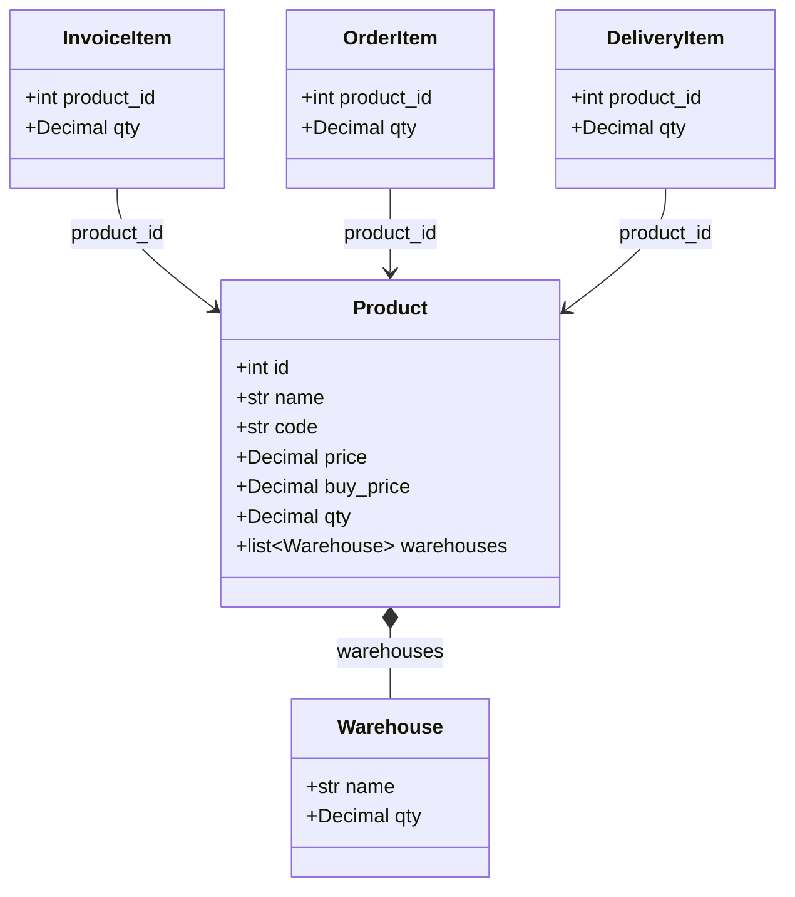

# Product

Product or service item in the Kledo inventory system.

Products represent items you sell to customers or purchase from vendors. Each product tracks pricing, inventory quantities, and stock distribution across warehouses.

## Relationships



## Fields

| Field | Type | Description |
|-------|------|-------------|
| `id` | int | Unique identifier (from BaseEntity) |
| `name` | str | Product name |
| `code` | str (optional) | SKU/product code |
| `description` | str (optional) | Product description |
| `price` | Decimal | Selling price |
| `buy_price` | Decimal | Cost/purchase price |
| `qty` | Decimal | Total stock quantity |
| `category_id` | int (optional) | Product category reference |
| `category_name` | str (optional) | Denormalized category name |
| `warehouses` | list[Warehouse] | Stock by warehouse |

## Embedded Type: Warehouse

Stock location with quantity. Embedded within Product.

| Field | Type | Description |
|-------|------|-------------|
| `name` | str | Warehouse name |
| `qty` | Decimal | Stock quantity in this warehouse |

## Related Tools

- `product_list` - List products with prices and inventory
- `product_get_detail` - Get product details by ID
- `product_search_by_sku` - Find product by SKU code

## Example

```json
{
  "id": 5678,
  "name": "Widget Pro X100",
  "code": "WPX-100",
  "description": "Professional grade widget with enhanced features",
  "price": "250000.00",
  "buy_price": "175000.00",
  "qty": "150.00",
  "category_id": 3,
  "category_name": "Electronics",
  "warehouses": [
    {"name": "Jakarta Warehouse", "qty": "100.00"},
    {"name": "Surabaya Warehouse", "qty": "50.00"}
  ]
}
```
